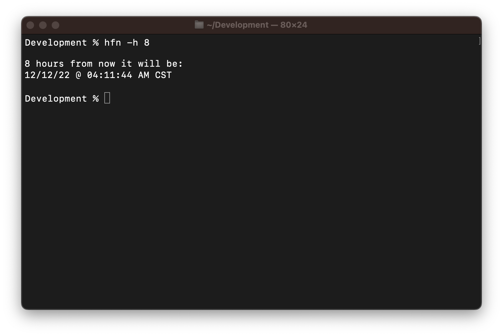
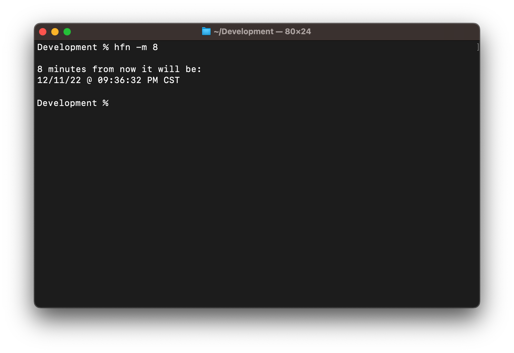
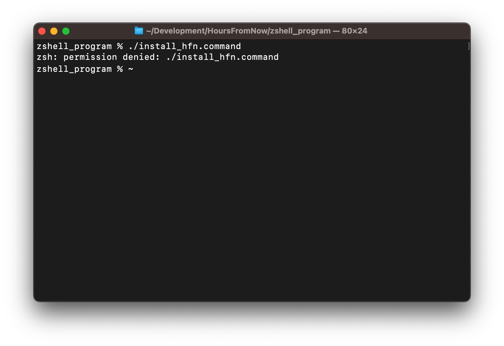

# HoursFromNow (HFN)

HoursFromNow (HFN) is a command-line tool enables a user to check what the date and time will be in the future, given a value supplied the user. 

## Contents
[How to use](#How-to-use)
[Installation](#Installation)
[Uninstallation](#Uninstallation)
[Future Improvements](#How-it_works)

## How to use
Lorem ipsum dolor sit amet, consectetur adipiscing elit. Curabitur malesuada pulvinar erat non convallis. Fusce tempor sit amet nibh vel ultricies. 

### Hours Flag (-h)
The **hours** command is used to calculate and display what the date and time will be given a user provided number of hours from the current (system) time. In order to use it, the `-h` flag is appended to the hfn command, and the user provides the number of hours they want to calculate after the `-h` flag. Usage syntax and an example are shown below:

**Usage Syntax**

    hfn -h {number of hours}

**Example**

### Minutes Flag
The **minutes** command is used to calculate and display what the date and time will be given a user provided number of minutes from the current (system) time. In order to use it, the `-m` flag is appended to the hfn command, and the user provides the number of minutes they want to calculate after the `-m` flag. Usage syntax and an example are shown below:

**Usage Syntax**

    hfn -m {number of minutes}

**Example**

## Installation
The HoursFromNow Repository comes with an installation script called `install_hfn.command`. This script can be ran by navigating to the file path of the cloned repository (e.g. ***~/Downloads/HoursFromNow/zshell_program***), and running the following command:
        
    ./install_hfn.command

This will then begin the installation process. 

> Please Note: If you receive the following error when you attempt to run the `./install_hfn.command` , you will need to add execution permission to the **install_hfn.command** script by running this command: 
> `chmod +x install_hfn.command`

When the installation script above is run, the following steps occur in the sequence listed below:
1. Copy the hfn script to the user's `/usr/local/bin` directory. (Ensures the command is in the user's **PATH**.
2. Prints out a **HFN Command Installed** confirmation message.

## Uninstallation
The HoursFromNow Repository comes with an uninstallation script called `uninstall_hfn.command`. This script can be ran by navigating to the file path of the cloned repository (e.g. ***~/Downloads/HoursFromNow/zshell_program***), and running the following command:
        
    ./uninstall_hfn.command

This will then begin the uninstallation process. 

> Please Note: If you receive the following error when you attempt to run the `./uninstall_hfn.command` , you will need to add execution permission to the `uninstall_hfn.command` script by running this command: 
> `chmod +x uninstall_hfn.command`

